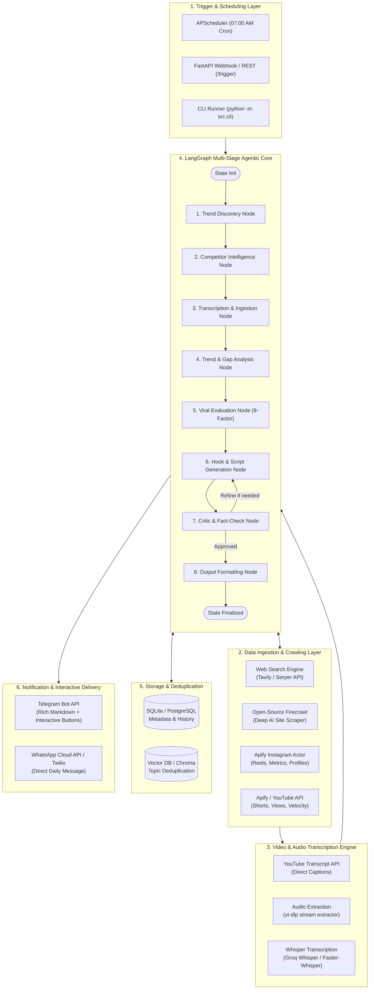
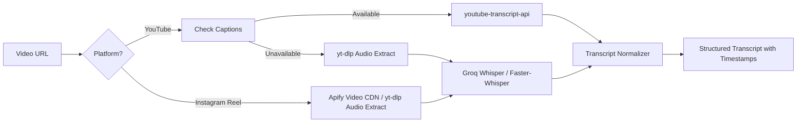
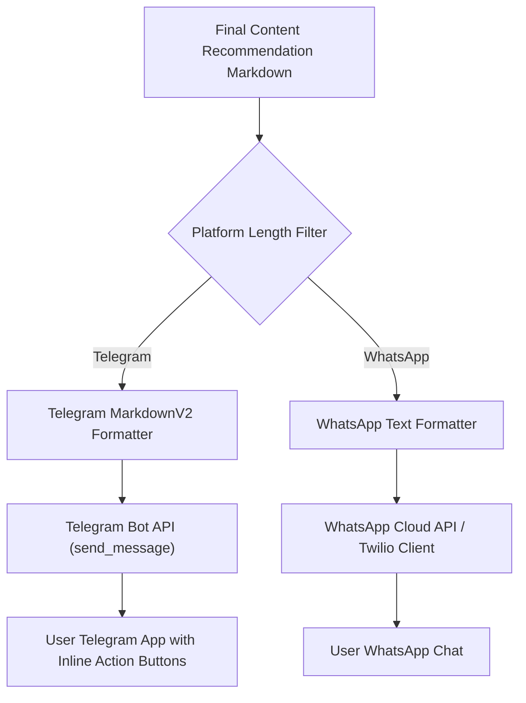
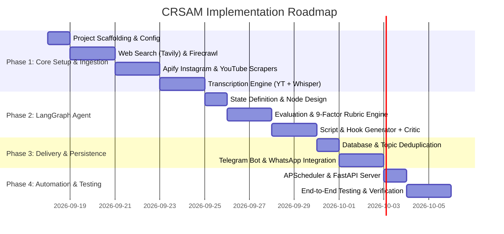

# CRSAM (Content Research & Scripting Autonomous Module)
## Production System Architecture & Implementation Plan

---

## 1. Executive Summary & System Vision

**CRSAM** is an autonomous, production-grade AI agent designed to act as your full-time **AI Content Strategist & Video Producer**. Every morning, it autonomously crawls the AI landscape, monitors competitor channels across Instagram and YouTube, transcribes high-performing videos, discovers cross-niche viral formats, evaluates ideas against a rigorous 9-factor viral framework, and delivers a ready-to-record 1–2 minute video script directly to your **Telegram / WhatsApp**.

```
┌────────────────────────────────────────────────────────────────────────────────────────┐
│                                 CRSAM CORE MISSION                                     │
│  Raw AI Signals + Competitor Patterns ──► Evaluation Framework ──► Daily Script + Hook │
│                  (Trending -> Relevant -> Adaptable -> High Virality)                  │
└────────────────────────────────────────────────────────────────────────────────────────┘
```

---

## 2. End-to-End System Architecture

### 2.1 High-Level Architecture Diagram



---

## 3. Core Component Deep-Dive

### 3.1 LangGraph Orchestration & State Machine

The entire intelligence pipeline is constructed as a **LangGraph StateGraph**. State is passed between nodes as a strongly typed Pydantic/TypedDict state object.

#### LangGraph State Schema (`AgentState`)
```python
from typing import TypedDict, List, Dict, Any, Optional
from pydantic import BaseModel

class CompetitorPost(BaseModel):
    platform: str  # 'instagram' | 'youtube'
    creator: str
    video_url: str
    title_or_caption: str
    views: Optional[int] = None
    likes: Optional[int] = None
    comments: Optional[int] = None
    transcript: Optional[str] = None
    audio_theme: Optional[str] = None
    is_public_metric: bool = True

class TrendCandidate(BaseModel):
    topic: str
    source_url: str
    source_type: str  # 'blog' | 'paper' | 'news' | 'launch'
    summary: str
    relevance_score: float

class ViralAssessment(BaseModel):
    trend_strength: str  # High / Medium / Low + reasoning
    audience_relevance: str
    share_potential: str
    save_potential: str
    replay_potential: str
    hook_strength: str
    competition_saturation: str
    execution_difficulty: str
    overall_score: float

class FinalContentRecommendation(BaseModel):
    topic: str
    why_now: str
    target_audience: str
    recommended_format: str
    recommended_length: str
    viral_matrix: ViralAssessment
    hook_3s: str
    hook_rationale: str
    script: Dict[str, str]  # hook, problem, main, demo, payoff, cta
    why_this_could_work: List[str]
    competitor_insights: Dict[str, Any]
    research_sources: Dict[str, List[Dict[str, str]]]
    raw_markdown: str

class AgentState(TypedDict):
    run_id: str
    execution_timestamp: str
    competitor_urls: List[str]
    raw_trends: List[TrendCandidate]
    competitor_posts: List[CompetitorPost]
    transcripts: Dict[str, str]
    shortlisted_topic: Optional[TrendCandidate]
    viral_assessment: Optional[ViralAssessment]
    generated_script: Optional[FinalContentRecommendation]
    critic_iterations: int
    validation_status: str  # 'approved' | 'rejected' | 'pending'
    error_log: List[str]
```

---

### 3.2 Trend & News Discovery Engine

#### 1. Web Search Engine (Tavily / Serper API)
- Queries dynamically generated across categories:
  - *AI Product Launches & GitHub Trending*: "trending open source AI agents site:github.com", "top new AI tools ProductHunt this week"
  - *Research & Models*: "new LLM release benchmark comparison", "HuggingFace trending papers"
  - *Tutorials & Workflows*: "viral AI automation tutorial workflows n8n LangGraph"
- Uses Tavily's `search_depth="advanced"` and topic filtering to eliminate generic fluff.

#### 2. Open-Source Firecrawl Scraping Engine
- **Why Firecrawl?** Converts modern, JavaScript-heavy sites (Substack, Medium, TechCrunch, AI product landing pages) into clean, token-efficient Markdown.
- **Implementation**:
  - Local/Self-hosted Docker instance (`firecrawl/api`) or Cloud SDK (`firecrawl-py`).
  - Scrapes AI company blogs (OpenAI, Anthropic, Mistral, Google AI, MarkTechPost).
  - Extracts key technical details and code snippets for accurate video demo generation.

---

### 3.3 Competitor Intelligence & Social Scraping (Apify)

#### 1. Instagram Competitor Monitoring
- **Tool**: Apify Actor `apify/instagram-reel-scraper` or `apify/instagram-profile-scraper`.
- **Target Data**:
  - Profile handles specified in `config/competitors.yaml`.
  - Latest 5-10 reels per competitor.
  - Video play count, like count, comment count, caption text, music/audio title, post timestamp.
  - Video CDN URLs for transcription.
- **Metric Integrity Guardrail**:
  - If Instagram hides view/like/share counts, CRSAM flags `metric_is_public: false` and explicitly marks in the report: `"This metric is not publicly available."` (zero fabrication).

#### 2. YouTube Shorts Monitoring
- **Tool**: Apify YouTube Scraper or YouTube Data API v3.
- Extracts top shorts in the AI niche uploaded within the last 48-72 hours.
- Computes engagement velocity: $\text{Velocity} = \frac{\text{Views}}{\text{Hours Since Published}}$.

---

### 3.4 Multi-Platform Video & Audio Transcription Engine



#### Transcription Pipeline:
1. **YouTube First-Line Strategy**:
   - Query `youtube-transcript-api` (instant, free, zero GPU overhead).
   - If auto-subtitles are disabled, fall back to step 2.
2. **Instagram & Fallback Audio Pipeline**:
   - Download audio stream via `yt-dlp` using optimized flags (`--extract-audio --audio-format mp3 --audio-quality 5`).
   - Run speech-to-text via **Groq Whisper Cloud API** (takes ~0.5 seconds per 60-second video, sub-cent cost) or **Faster-Whisper** locally.
3. **Format & Hook Analyzer**:
   - Isolates the first 3-5 seconds of transcript to study competitor hook mechanics.

---

### 3.5 Content Evaluation Framework (The 9-Factor Matrix)

Every topic is systematically evaluated against the framework established in `prompt.md`:

| Metric | Assessment Formula / Criteria | Score Weight |
|---|---|:---:|
| **1. Trend Strength** | 24-48h news acceleration, search volume spike, GitHub stars velocity | 15% |
| **2. Audience Relevance** | Overlap with AI builders, tech enthusiasts, professionals seeking productivity | 15% |
| **3. Share Potential** | High utility, "must show my team/friend", relatable problem-solving | 15% |
| **4. Save Potential** | Step-by-step tutorial, prompt template, tool lists, reference guides | 15% |
| **5. Replay Potential** | Fast pacing, visual demonstration, seamless loop ending, curiosity resolution | 10% |
| **6. Hook Strength** | Pattern interrupt in first 3s (visual, counter-intuitive statement, strong problem) | 15% |
| **7. Saturation** | Has every creator already made this? (If yes, penalize unless unique angle found) | 10% |
| **8. Execution Difficulty** | Can it be recorded in 1-2 hours without complex 3D VFX or heavy setups? | 5% |

#### Cross-Niche Adaptation Engine
CRSAM maintains a library of viral non-AI formats (Finance, Fitness, Productivity, Storytelling) and translates their underlying psychological triggers to AI topics.
- *Example*: Finance ("The 3 index funds that made me rich") $\rightarrow$ AI ("The 3 AI automations that save me 15 hours a week").

---

### 3.6 Script & Hook Generator + Fact Validator

#### Strict Output Generation
Adheres to the exact layout required by `prompt.md`:
1. **Header & Summary**: Topic, Why Now, Target Audience, Format & Length.
2. **Viral Matrix Table**: Markdown table with ratings + explicit justifications.
3. **First 3 Seconds Hook**: The exact verbal + visual hook + psychological rationale.
4. **Structured 1–2 Min Script**:
   - `Hook (0-3s)`
   - `Problem/Context (3-15s)`
   - `Main Content (15-45s)`
   - `Example/Demo (45-75s)`
   - `Payoff (75-90s)`
   - `CTA (90-105s)`
   - `Looping Ending`
5. **Why This Could Work**: 3 distinct strategic factors.
6. **Competitor Insights**: Competitor name, video link, what worked, how we adapt it.
7. **Research Sources**: Traceable links to blogs, reels, and official company release notes.

#### Critic & Fact-Check Gate
Before sending, a Critic Agent checks:
- [x] Are all source links valid?
- [x] Does the script follow the exact time pacing?
- [x] Are competitor metrics strictly public or labeled unavailable?
- [x] Has this topic been suggested within the last 30 days?

---

### 3.7 Delivery & Messaging Engine



#### 1. Telegram Bot (Recommended Primary Delivery)
- Rich formatting with emojis, bold headers, and clean tables.
- **Interactive Inline Buttons**:
  - `[✅ Approve & Save]` $\rightarrow$ Saves script to Obsidian/Notion.
  - `[🔄 Regenerate Hook]` $\rightarrow$ Requests 3 alternative hooks on the fly.
  - `[📊 View Competitor Video]` $\rightarrow$ Opens source Reel.

#### 2. WhatsApp API (Meta Cloud API / Twilio)
- Clean, structured plain-text formatting with emoji bullet points.
- Delivers the morning digest reliably at 07:00 AM.

---

### 3.8 Trigger & Scheduling Layer

- **APScheduler**: Background async cron scheduler running inside the Python service.
- **FastAPI Endpoints**:
  - `POST /api/v1/agent/run`: Trigger manual run immediately.
  - `GET /api/v1/agent/history`: View past recommendations.
  - `GET /api/v1/health`: Liveness probe.
- **CLI Mode**: `python -m src.cli run --dry-run` for instant terminal testing and debugging.

---

## 4. Production-Ready Directory Structure

```
CRSAM/
├── .env.example                     # Environment template with all required keys
├── .gitignore                       # Git ignore for venv, cache, downloads, sqlite
├── pyproject.toml                   # Project dependencies and packaging (uv / poetry / pip)
├── README.md                        # Documentation & setup guide
├── plan.md                          # Master architectural plan (this file)
├── prompt.md                        # Original product requirements
├── docker-compose.yml               # Docker compose for Firecrawl, Redis/Postgres (optional)
├── Dockerfile                       # Multi-stage production Dockerfile
│
├── config/                          # Central configuration files
│   ├── settings.py                  # Pydantic BaseSettings (env parsing & validation)
│   ├── competitors.yaml             # List of Instagram/YouTube competitors to monitor
│   ├── sources.yaml                 # AI blogs, news feeds, RSS, and sites to crawl
│   └── prompts.yaml                 # System prompts for Evaluator, Scriptwriter, Critic
│
├── data/                            # Local storage (gitignored except .gitkeep)
│   ├── db.sqlite3                   # SQLite database for run history & deduplication
│   ├── cache/                       # Cached transcripts & competitor raw responses
│   └── audio_temp/                  # Transient audio downloads for Whisper
│
├── src/                             # Application source code
│   ├── __init__.py
│   ├── main.py                      # FastAPI server & APScheduler application entrypoint
│   ├── cli.py                       # Command line interface for debugging & manual runs
│   │
│   ├── agent/                       # LangGraph Multi-Agent Implementation
│   │   ├── __init__.py
│   │   ├── state.py                 # Pydantic models & TypedDict AgentState
│   │   ├── graph.py                 # StateGraph definition, nodes, and conditional edges
│   │   └── nodes/                   # Individual LangGraph execution nodes
│   │       ├── __init__.py
│   │       ├── discovery_node.py    # Search & news crawling node
│   │       ├── competitor_node.py   # Competitor scraper & ingestion node
│   │       ├── transcribe_node.py   # Multi-platform audio/video transcription node
│   │       ├── analyzer_node.py     # Trend & cross-niche gap analysis node
│   │       ├── evaluator_node.py    # 9-Factor viral potential evaluation node
│   │       ├── script_node.py       # Hook & script generation node
│   │       ├── critic_node.py       # Fact-check & quality validator node
│   │       └── formatter_node.py    # Telegram/WhatsApp markdown formatting node
│   │
│   ├── tools/                       # External API tools & clients
│   │   ├── __init__.py
│   │   ├── search/                  # Web search tools
│   │   │   ├── __init__.py
│   │   │   ├── tavily_client.py     # Tavily AI Search client
│   │   │   └── serper_client.py     # Serper / Google Search client
│   │   ├── crawler/                 # Scraping tools
│   │   │   ├── __init__.py
│   │   │   ├── firecrawl_client.py  # Open-source Firecrawl client
│   │   │   └── apify_client.py      # Apify Instagram/YouTube scrapers
│   │   └── transcription/           # Speech-to-text tools
│   │       ├── __init__.py
│   │       ├── yt_transcriber.py    # YouTube Transcript API client
│   │       └── audio_transcriber.py # yt-dlp + Groq Whisper / Faster-Whisper
│   │
│   ├── delivery/                    # Messaging & Notification providers
│   │   ├── __init__.py
│   │   ├── base.py                  # BaseNotifier abstract class
│   │   ├── telegram_bot.py          # Telegram Bot API client & interactive handler
│   │   └── whatsapp_client.py       # WhatsApp Cloud API / Twilio client
│   │
│   ├── db/                          # Database models & repositories
│   │   ├── __init__.py
│   │   ├── database.py              # SQLAlchemy / SQLModel engine & session
│   │   ├── models.py                # Recommendations, Competitors, Runs models
│   │   └── repository.py            # CRUD operations & deduplication queries
│   │
│   └── utils/                       # Shared utility functions
│       ├── __init__.py
│       ├── logger.py                # Loguru structured logging setup
│       ├── formatters.py            # Text & Markdown cleaning helpers
│       └── metrics.py               # Engagement velocity calculation
│
└── tests/                           # Comprehensive test suite
    ├── __init__.py
    ├── test_transcription.py        # Unit tests for YT and Whisper transcription
    ├── test_scrapers.py             # Integration tests for Apify and Firecrawl
    ├── test_evaluator.py            # Unit tests for 9-factor scoring logic
    └── test_agent_graph.py          # End-to-end LangGraph pipeline test
```

---

## 5. Configuration & Environment Schema (`.env.example`)

```ini
# ================================================================
# LLM Providers (LangChain / LangGraph)
# ================================================================
OPENAI_API_KEY=sk-...
ANTHROPIC_API_KEY=sk-ant-...
GROQ_API_KEY=gsk-...                  # For ultra-fast Whisper transcription & Llama 3

# ================================================================
# Search & Crawling
# ================================================================
TAVILY_API_KEY=tvly-...
APIFY_API_TOKEN=apify_api_...
FIRECRAWL_API_KEY=fc-...              # Or self-hosted URL
FIRECRAWL_BASE_URL=http://localhost:3002

# ================================================================
# Delivery / Notifications
# ================================================================
# Telegram Settings
TELEGRAM_BOT_TOKEN=123456789:ABCdef...
TELEGRAM_CHAT_ID=987654321

# WhatsApp Settings (Twilio or Meta Cloud API)
WHATSAPP_PROVIDER=telegram            # 'telegram' | 'whatsapp_twilio' | 'whatsapp_cloud'
TWILIO_ACCOUNT_SID=AC...
TWILIO_AUTH_TOKEN=...
TWILIO_WHATSAPP_NUMBER=whatsapp:+14155238886
TARGET_WHATSAPP_NUMBER=whatsapp:+1234567890

# ================================================================
# Scheduler & App Configuration
# ================================================================
CRON_SCHEDULE="0 7 * * *"             # Everyday at 07:00 AM
TIMEZONE="Asia/Kolkata"
DATABASE_URL="sqlite+aiosqlite:///./data/db.sqlite3"
LOG_LEVEL="INFO"
```

---

## 6. Detailed Step-by-Step Implementation Roadmap



### Phase 1: Foundation, Scraping & Transcription Engine
1. Set up project structure, `pyproject.toml`, dependencies, and environment configuration.
2. Implement `tavily_client.py` and `firecrawl_client.py` for AI news discovery.
3. Implement `apify_client.py` to ingest competitor reels & YouTube shorts with zero fake metric hallucination.
4. Implement `yt_transcriber.py` and `audio_transcriber.py` (using Groq Whisper / Faster-Whisper) to transcribe video content with timestamps.

### Phase 2: LangGraph Orchestration & Evaluation Framework
1. Define typed `AgentState` schema and Pydantic validation models.
2. Build the **Trend Discovery Node** & **Competitor Intelligence Node**.
3. Implement the **Viral Evaluation Node** executing the 9-factor rubric (Trend Strength, Share/Save potential, Replay potential, Hook viability).
4. Implement the **Hook & Script Node** generating the exact structured 1–2 min script.
5. Implement the **Critic Node** to review pacing, verify sources, and guard against metric fabrication.

### Phase 3: Delivery, Deduplication & Storage
1. Setup SQLite database with SQLModel for run logs, recommended scripts, and competitor post tracking.
2. Add vector/keyword deduplication so previously recommended topics are not re-suggested.
3. Implement `telegram_bot.py` (with rich formatting and action buttons) and `whatsapp_client.py`.

### Phase 4: Triggering, Scheduling & Deployment
1. Build `main.py` with FastAPI and APScheduler for automated daily execution at 7:00 AM.
2. Build `cli.py` for easy local testing, dry-runs, and ad-hoc single topic generation.
3. Write comprehensive unit and integration tests.

---

## 7. Key Engineering Trade-offs & Recommendations

| Decision Area | Option A | Option B (Recommended) | Why Option B? |
|---|---|---|---|
| **Primary Messaging** | WhatsApp Cloud API | **Telegram Bot API** (with WhatsApp optional) | Telegram is 100% free, has zero template approval delays, supports rich Markdown, code blocks, and interactive callback buttons. WhatsApp can be used as a secondary sync. |
| **Transcription** | Local OpenAI Whisper | **Groq Whisper API** (with local fallback) | Groq transcribes a 60s reel in ~500ms at virtually zero GPU/CPU cost on the host machine. |
| **Web Scraping** | Raw BeautifulSoup/Playwright | **Firecrawl + Apify** | Firecrawl handles modern JS hydration and outputs pristine LLM markdown; Apify handles Instagram anti-bot measures seamlessly. |
| **Agent Framework** | Raw Python Loops / CrewAI | **LangGraph** | LangGraph gives deterministic state transitions, clear cycle loops (Critic $\rightarrow$ Rewriter), and checkpoint persistence. |

---

## 8. Summary of What We Will Build Next

1. `config/settings.py` & `config/competitors.yaml` for configuration.
2. `src/tools/` for Tavily, Firecrawl, Apify, and Whisper transcription.
3. `src/agent/` for the complete LangGraph StateGraph pipeline.
4. `src/delivery/` for Telegram and WhatsApp dispatchers.
5. `src/main.py` & `src/cli.py` for scheduling, APIs, and command-line execution.
